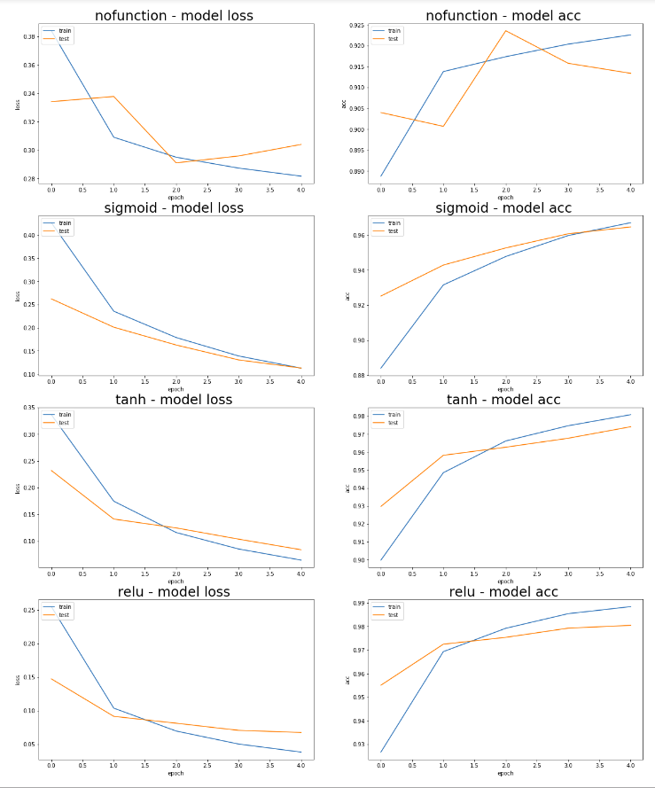
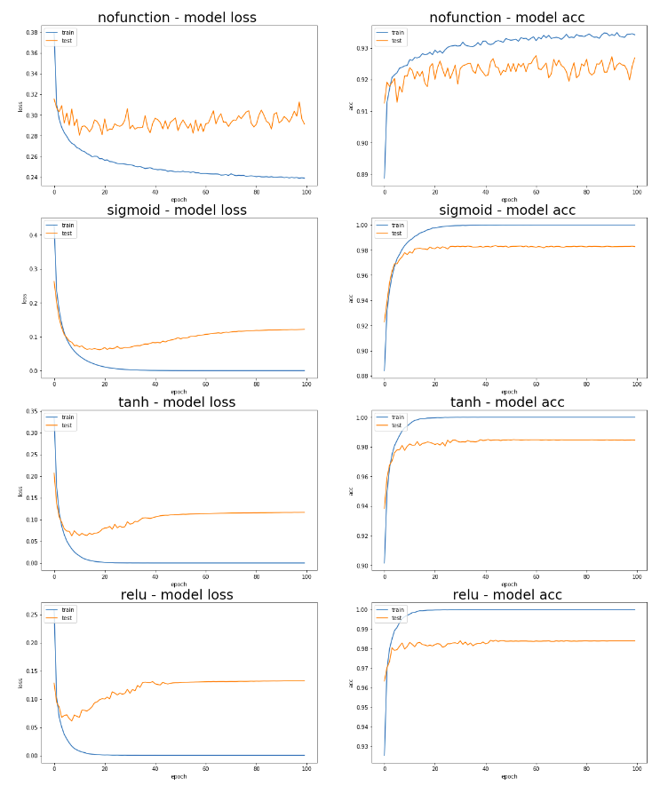

# Testing Activation Functions

A set of neural network model with the purpose of compare different activation functions and it effect to the learning process.
This is inspired in the following article:

[Exploring Activation Functions for Neural Networks](https://towardsdatascience.com/exploring-activation-functions-for-neural-networks-73498da59b02)

In this article you can find detailed information on:
- neural network architecture
- explanation of effect different activation functions

## Dataset

This test is using the hello world dataset of neural networks:

[THE MNIST DATABASE](http://yann.lecun.com/exdb/mnist/)

The mnist dataset is in IDX format, a description of how this dataset is here:

[Converting MNIST dataset for Handwritten digit recognition in IDX Format to Python Numpy Array](https://medium.com/@mannasiladittya/converting-mnist-data-in-idx-format-to-python-numpy-array-5cb9126f99f1)

Also here is a repo were we can find a way to parse it:

[read and show images dataset](https://gist.github.com/akesling/5358964)

## Model Under Test
The model is very simple

    model = Sequential()
    model.add(Dense(512, input_shape=(784,)))
    model.add(Dense(10, activation='softmax'))

The only thing that changes is the activation function in the hidden layer.

These are the functions under test:

- None (no activation function)
- Sigmoid
- Tanh
- Relu

# Notebooks

- [basic](comparing-activationfunctions-basic.ipynb), shows how to read the mnist data set, see the number images and various adhoc tests

- [plots](comparing-activationfunctions-comparison.ipynb), shows a side by side comparison between the different models. 

As we can see from results:

1. The model does not use an activation function is not capable to learn well. 
2. The models that does use an activation function are able to learn. 
2. Changing the activation functions it only affects how fast the model can learn but not how much.

## 5 Epochs

## 100 Epochs

## Other References
* [How to Get Reproducible Results with Keras](https://machinelearningmastery.com/reproducible-results-neural-networks-keras/)
